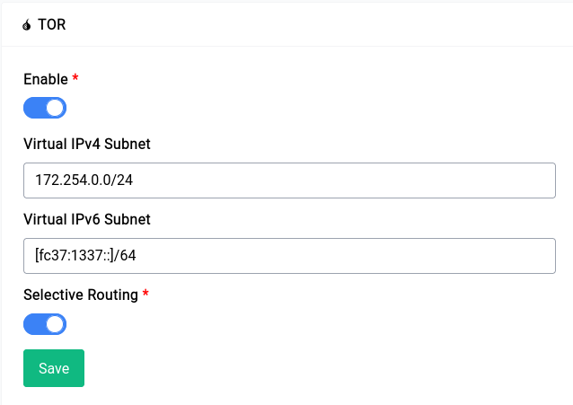

# TOR

TOR is a free and open-source software for enabling anonymous communication. It is used to protect your privacy online and to circumvent censorship. Difuse ships with a TOR client. The TOR client is used to connect to the TOR network.

<center>
<a data-fancybox data-src="./img/43.png" data-caption="Services - TOR">
  
</a>
</center>

By default the TOR service is enabled, you can disable it by clicking on the toggle button and then clicking on the save button.

The service page gives you a few options to configure the TOR client, let's go over them:

## Virtual IPv4 Subnet

This field is equivalent to the `VirtualAddrNetworkIPv4` option in the TOR configuration file. You can specify a virtual IPv4 subnet for the TOR client to use or just leave it as is to use the default.

## Virtual IPv6 Subnet

This field is equivalent to the `VirtualAddrNetworkIPv6` option in the TOR configuration file. You can specify a virtual IPv6 subnet for the TOR client to use or just leave it as is to use the default.

## Selective Routing

```admonish warning
Selective routing is **not** a very good idea as it can be used to de-anonymize you by simply including non-tor traffic in a web page
```

If you're a casual tor user just using it to bypass censorship or to access a few websites this is a really nifty trick as it routes all the traffic to .onion domains through TOR and the rest of the traffic through your regular internet connection.

This option takes care of all the firewall and DNS rules for you, all you have to do is enable it and you're good to go.