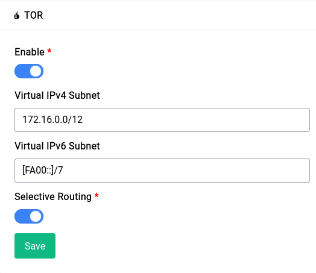

# TOR

TOR is a free and open-source software for enabling anonymous communication. It is used to protect your privacy online and to circumvent censorship. Difuse ships with a TOR client. The TOR client is used to connect to the TOR network.

<center>
<a data-fancybox data-src="./img/43.png" data-caption="Services - TOR">
  
</a>
</center>

By default the TOR service is enabled, you can disable it by clicking on the toggle button and then clicking on the save button.

The service page gives you a few options to configure the TOR client, let's go over them:

## Virtual IPv4 Subnet

This field is equivalent to the `VirtualAddrNetworkIPv4` option in the TOR configuration file. You can specify a virtual IPv4 subnet for the TOR client to use or just leave it as is to use the default.

```admonish warning
You should **not** use the same subnet as your local network, this will make it so that you can't access the GUI or SSH into your router, essentially locking you out.

You also should **not** use the same subnet as any of your VPN clients/peers as this will make it so that you can't access them.
```

## Virtual IPv6 Subnet

```admonish warning
You should **not** use the same subnet as your local network, this will make it so that you can't access the GUI or SSH into your router, essentially locking you out.

You also should **not** use the same subnet as any of your VPN clients/peers as this will make it so that you can't access them.
```

This field is equivalent to the `VirtualAddrNetworkIPv6` option in the TOR configuration file. You can specify a virtual IPv6 subnet for the TOR client to use or just leave it as is to use the default.

## Selective Routing

```admonish warning
Selective routing is **not** a very good idea as it can be used to de-anonymize you by simply including non-tor traffic in a web page
```

If you're a casual tor user just using it to bypass censorship or to access a few websites this is a really nifty trick as it routes all the traffic to .onion domains through TOR and the rest of the traffic through your regular internet connection.

Some browsers like Firefox block .onion domains by default, you can enable them by going to `about:config` and setting `network.dns.blockDotOnion` to `false`.

This option takes care of all the firewall and DNS rules for you, all you have to do is enable it and you're good to go.

## Using TOR

You can either enable selective routing or just use the TOR client as a proxy. If you want to use it as a proxy you can use `127.0.0.1:9050`, replace `127.0.0.1` with your router's IP address in our case it's `192.168.1.1` so the proxy address would be `192.168.1.1:9050`.

You can visit the following onion URLs to test your connection:

- [Wayback Machine](http://archiveiya74codqgiixo33q62qlrqtkgmcitqx5u2oeqnmn5bpcbiyd.onion/)
- [Mullvad VPN](http://o54hon2e2vj6c7m3aqqu6uyece65by3vgoxxhlqlsvkmacw6a7m7kiad.onion/en)
- [Proton Mail](https://protonmailrmez3lotccipshtkleegetolb73fuirgj7r4o4vfu7ozyd.onion/)
- [DuckDuckGo](https://duckduckgogg42xjoc72x3sjasowoarfbgcmvfimaftt6twagswzczad.onion/)


## Troubleshooting

If you have any issues with the TOR client you can disable it by toggling the disable button and then clicking on the save button. This will disable the TOR client and remove all the firewall and DNS rules. Once that is done you can enable it again and it should work.