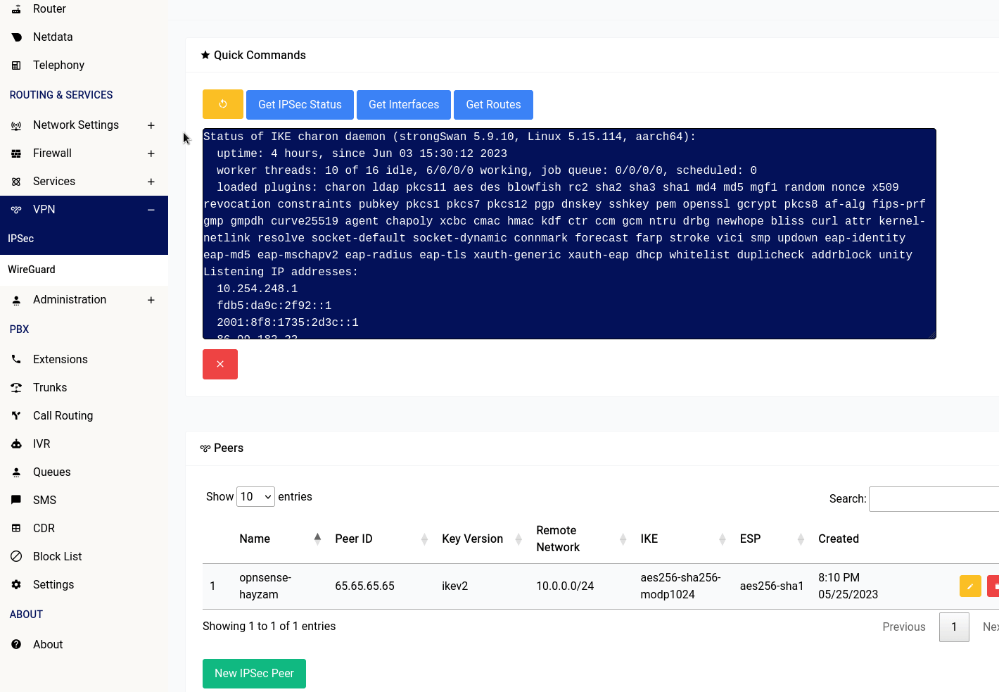
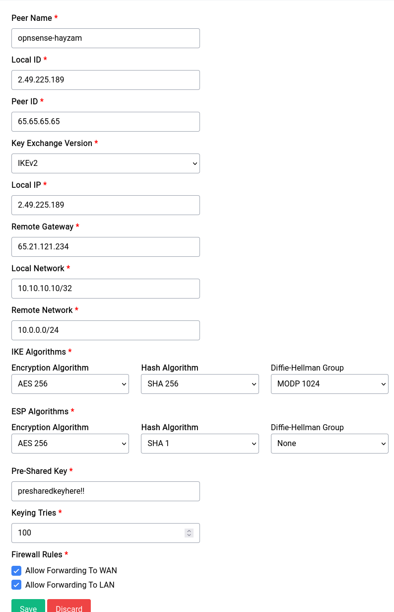

# IPSec

```admonish warning
IPSec is pretty complicated and we **don't recommend** you to use it unless you know what you're doing. If you're looking for a VPN solution, we recommend you to use WireGuard instead, which is much simpler, faster and easier to setup.
```

## Overview

IPSec is a protocol suite that is used to secure traffic on a network. It is used to authenticate and encrypt traffic between two peers. It is commonly used in VPNs to secure the traffic between the client and the server. Difuse only implements PSK (Pre-Shared Key) based IPSec tunnels.

## Quick Commands

<a data-fancybox data-src="./img/1.gif" data-caption="IPSec - Quick Commands">
  
</a>

There are 4 buttons in the IPSec section of the web interface:

* **Restart IPSec**: This button will restart the IPSec service running on your device.
* **Get IPSec Status**: This button will show you the status of the IPSec service running on your device.
* **Get Interfaces**: This button will show you the interfaces that are currently configured on your device.
* **Get Routes**: This button will show you the routes that are currently configured on your device.

## Setting up a peer

<a data-fancybox data-src="./img/2.png" data-caption="IPSec - Adding a peer">
  
</a>

As you can see there are a lot of options to configure a peer, let's go over them one by one:

### Peer Name

This is the name of the peer, it can be anything you want.

### Local ID

This is the local ID of the peer, it is used to identify the peer on your side of the tunnel. It can and probably should be an IP address.

### Peer ID

This is the peer ID of the peer, it is used to identify the peer on the other side of the tunnel. It can and probably should be an IP address.

### Key Exchange Version

This is the version of the key exchange protocol that will be used to establish the tunnel. IKEv1 and IKEv2 are supported.

### Local IP

This is the local IP address of the peer, it is used to identify the peer on your side of the tunnel. It can and probably should be an IP address. **FQDNs are not supported yet**.

### Remote Gateway

This is the remote gateway of the peer, it is the IP address of the peer on the other side of the tunnel. It can and probably should be an IP address. **FQDNs are not supported yet**.

### Local Network

This is the left side or local network of the tunnel, it is the network that is behind the peer on your side of the tunnel. It probably should be an IP that is separate from the subnet of the peer and subnet of LAN.

### Remote Network

This is the right side or remote network of the tunnel, it is the network that is behind the peer on the other side of the tunnel.

### IKE and ESP Algorithms

These are the algorithms that will be used to encrypt the traffic between the peers. You can choose any combination of algorithms that you want, but you should choose the ones that are supported by the peer.

### Pre-Shared Key

This is the pre-shared key that will be used to authenticate the peers. It should be a long and random string.

### Keying Retries

This is the number of times the device will try to establish the tunnel before giving up.

### Firewall Rules

These are the firewall rules that will be applied to the traffic that is going through the tunnel. It's best to leave it at allow forwarding to WAN and LAN.

