# VPN - WireGuard

WireGuard is a modern VPN protocol with state-of-the-art formally verified cryptography while being extremely minimal and fast.

There are many different ways you can use WireGuard and we’re going to demonstrate a few ways you could use it effectively:

* Connecting to a VPN to route to route some IPv4 traffic through it.
* Connecting to a Site-To-Site VPN to access a LAN that is outside your network.
* Creating a server (endpoint) along with provisioning some peers that can connect to it.

## Routing WAN Traffic

In our [Routes](/network-settings/routes.html) guide, we wrote about how you can route traffic through a specific WireGuard Endpoint for a single (or multiple) website. Now we’re going to setup that WireGuard endpoint that made it possible.

The first thing that you’ll need to do is go into the **Clients** tab of the WireGuard page and click on the **"Create New Client"** button, you will be greeted with a form that has a lot of inputs, now you can either fill in the form yourself or you can import a configuration that you you or your provider has generated.

### Importing Configuration

A configuration usually looks something very similar to this:

```
[Interface]
Address = 172.19.210.3/32,fc00:deeb:2a4e:0000:0000:0000:0000:0003/128
PrivateKey = yM+DlGcSO2Br8kNfjTwbZkyM+DlGcr8h/SKYwnUPX04=
DNS = 1.1.1.1,2606:4700:4700::1111
MTU = 1280

[Peer]
PublicKey = ySvXw64LcpJK5TOBglw64LcpJK5h7yN6bL5x4=
AllowedIPs = 0.0.0.0/0,::0/0
Endpoint = example.example.com:46170
PersistentKeepalive = 25
```

You can click on the Import Config button and simply paste the configuration into the modal that opens up like this:

<a data-fancybox data-src="./img/30.png" data-caption="WireGuard - Import Configuration">
  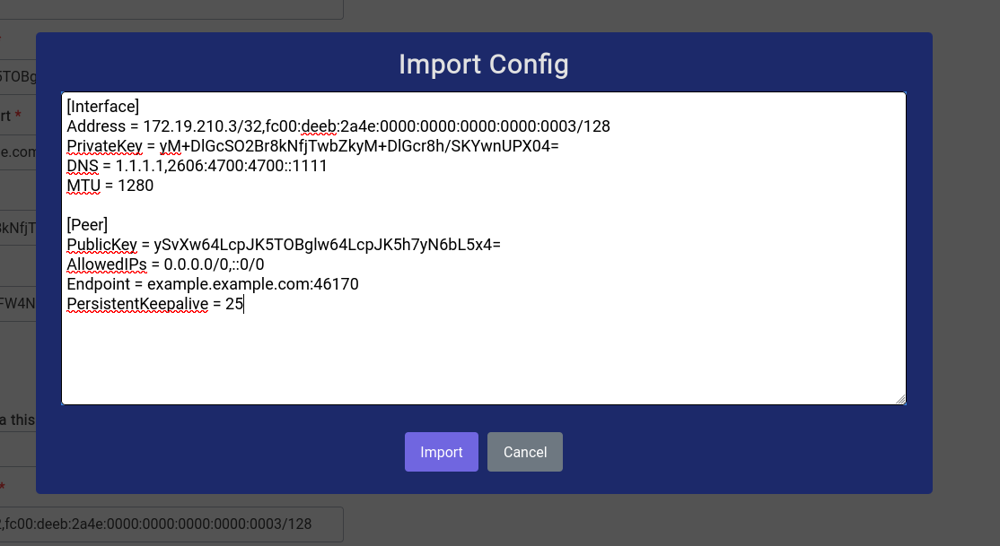
</a>

Once you have copied the configuration in, just click on the Import button and most of the fields should be filled automatically like this:

<center>
<a data-fancybox data-src="./img/31.png" data-caption="WireGuard - Import Configuration - Filled">
  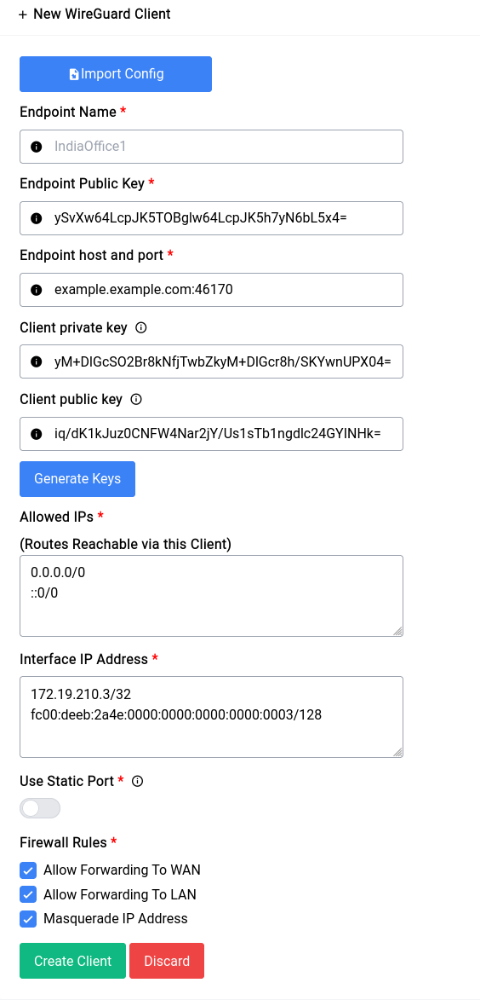
</a>
</center>

You still have to fill in a name for the client, always give something **small and simple**, in our case we’ll call it **PIA** (Private Internet Access).

If for some reason you don’t have a configuration or would like to fill out the form yourself, you can always do that and just not use the Import Config button.

It’s a good idea to leave static port disabled, but some endpoints will require you to connect and reconnect with the same listening port, in that case you can turn it on and specify a port.

As far as Allowed IPs (Routes Reachable via this Client) goes, since we don’t know the IPs we will be routing for we give in:

```
0.0.0.0/0
::0/0
```

that simply means **all** IPv4 and IPv6. This will add a route to all subnets, but the WireGuard interface is always assigned a higher metric than the existing WAN interfaces so it will not start routing all traffic immediately, you need to manually assign a route using Policy Based Routes or Static IPv4/IPv6 Route.

For this setup we’re going to check all the firewall rules, here’s a brief description of all of them:

* **Allow Forwarding to WAN**: This allows the WireGuard interface to forward traffic to the WAN interface and receive from the WAN interface as well.
* **Allow Forwarding To LAN**: This allows clients on the LAN to forward their traffic to the WireGuard interface and vice versa.
* **Masquerade IP Address**: This is critical for being able to route your traffic to hosts that are in the public domain, as they must see your WireGuard endpoints WAN IP and not your local IP.

So in summary if you’re going to use your WireGuard endpoint for routing certain WAN traffic, you need to enable all these 3 options, or create your own firewall rules which may start getting confusing, especially if you have more than one endpoint configured.

Now once it’s setup, it should look something like this:

<a data-fancybox data-src="./img/32.png" data-caption="WireGuard - Clients Table">
  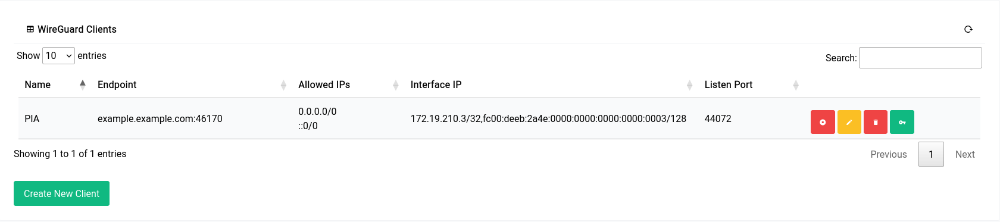
</a>

The interface will show up in the routing pages now albeit with a slightly different name:

<center>
<a data-fancybox data-src="./img/33.png" data-caption="WireGuard - Interface in Routing">
  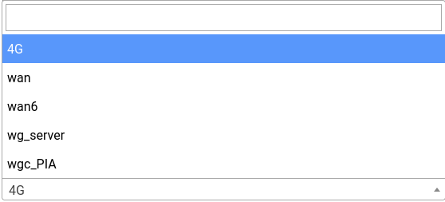
</a>
</center>

**wgc_PIA** is the interface we just created.

## Site-To-Site VPN

Now imagine you have an office in Dubai, but you work remotely from India and there’s a device in the LAN network of the office in Dubai and you want to access that securely, site-to-site VPNs are the way to go.

The setup is very similar to the one that we did for the **Traffic Routing** endpoint with the key difference being us adding the specific LAN IP Range instead of `0.0.0.0/0 ::0/0` for the **Allowed IPs** like this:

<center>
<a data-fancybox data-src="./img/34.png" data-caption="WireGuard - Site-To-Site - Routes">
  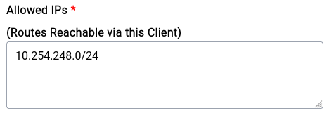
</a>
</center>

```
[Interface]
Address = 172.19.210.2/32,fc00:deeb:2a4e:0000:0000:0000:0000:0002/128
PrivateKey = wGiO88ShFkNXEbCWX/9Cw5UbV9goh4AgfLhKyoX0r1E=
DNS = 172.19.210.1,fc00:deeb:2a4e::1
MTU = 1280

[Peer]
PublicKey = ySvXw64LcpJK5TOaT7J5wDBBglcjrppg9h7yN6bL5x4=
AllowedIPs = 172.19.210.1/24,fc00:deeb:2a4e::1/64,10.254.248.0/24
Endpoint = example.example.com:46170
PersistentKeepalive = 25
```

This is an example configuration for a **Site-To-Site VPN**, notice the **AllowedIPs** now contains the exact IPs that we need to allow:

```
172.19.210.1/24
10.254.248.0/24
fc00:deeb:2a4e::1/64
```

This will add the routes into the routing table albeit still with higher metric, but since there’s a Destination provided this time it will always be chosen if queried by a client for traffic to be routed through.

You can always still keep:

```
0.0.0.0/0
::0/0
```

as your allowed IPs and add manual Static or Policy based routes, but doing this is in the client configuration itself is a lot more cleaner and the recommended way of doing things.

Now as far as Firewall Rules are concerned we don’t need the client to allow forwarding to WAN nor do we need masquerading since we’re just accessing their LAN clients, so the checkboxes will look something like this:

<center>
<a data-fancybox data-src="./img/35.png" data-caption="WireGuard - Site-To-Site - Firewall Rules">
  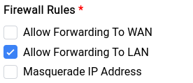
</a>
</center>

## Creating a Server (Endpoint) with Peers

Netflix recently came out with a policy that made password sharing (if you’re not under the same roof) against their Terms-Of-Service and the way they’re blocking it is by looking at your IP address, now the reason why we’re mentioning this is because it’s a good example of where a VPN endpoint will do the trick and let you (who is away from home in this example) browse netflix like you never left.

Creating a WireGuard endpoint (we like to call this the Server) on your device is trivial, especially if you don’t want to add any custom configuration (like IP Addresses).

Now coming to the actual setup, you can switch to the **Server** tab in the WireGuard page and click on the **Auto Fill** button.

<center>
<a data-fancybox data-src="./img/36.png" data-caption="WireGuard - Server - Config">
  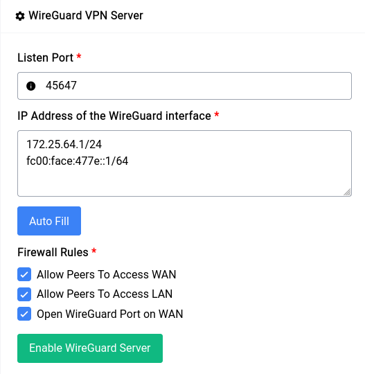
</a>
</center>

This will fill the **Listen Port** as well as the **IP Address** section with a random **(unused)** port and IP Address respectively. Now as far as firewall rules are concerned for our example we’re going to let the peers access both the WAN and LAN network. But if you want the peers to be only able to connect to the devices in the LAN network **uncheck** the first checkbox.

Since WireGuard needs a port, specifically a UDP port to function it’s a good idea to check the **Open WireGuard Port on WAN** option so that all the peers can connect to the underlying WireGuard server.

Once the form inputs have been filled you can just click on the Enable WireGuard Server button and you’re off to the races!

Once the setup is done (which might take a few seconds) you should see something like this:

<center>
<a data-fancybox data-src="./img/36.png" data-caption="WireGuard - Server">
  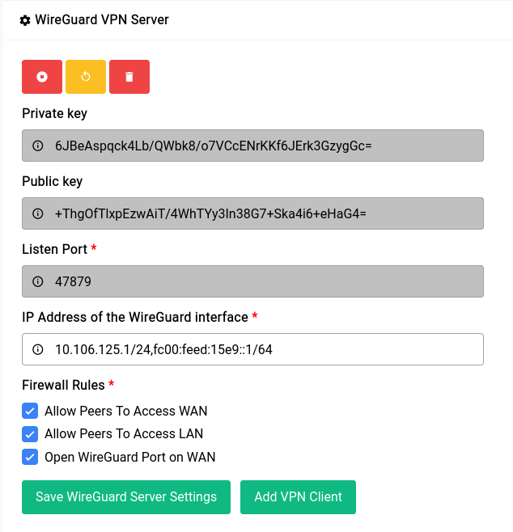
</a>
</center>

The private and public key’s are securely auto generated and it **cannot** be changed. This is a good time to make changes if any to the IP Address and Firewall Rules section.

Now that we have an endpoint running, let’s add a client (or a Peer in WireGuard terms). You can just click on the **Add VPN Client** button and it will show a form where you can type in specifics:

<center>
<a data-fancybox data-src="./img/38.png" data-caption="WireGuard - Server - Add Client">
  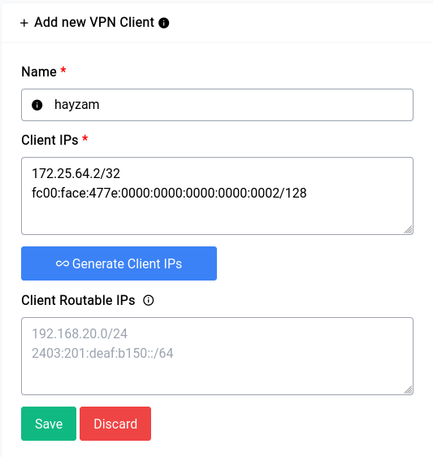
</a>
</center>

If you click on the **Generate Client IPs** button it will auto fill with the next IP in the range that you specified, we highly **recommend** you use the auto generate function of both the client and server sections as this makes configuration let’s vulnerable to problems.

Now you can see a form element that we’ve kept empty, namely the **Client Routable IPs** element. In this section you can fill in an IP Address or range like `10.254.248.0/24` in our previous example, what this would do is allow us to access that range in our Clients network. But in our case since we just want the client to be able to access the WAN through us, it should be fine to leave it empty, but this is something to keep in mind.

Now when you click on Save it will show the peer along with their details in the table on top of the server configuration section:

<center>
<a data-fancybox data-src="./img/39.png" data-caption="WireGuard - Server - Peer">
  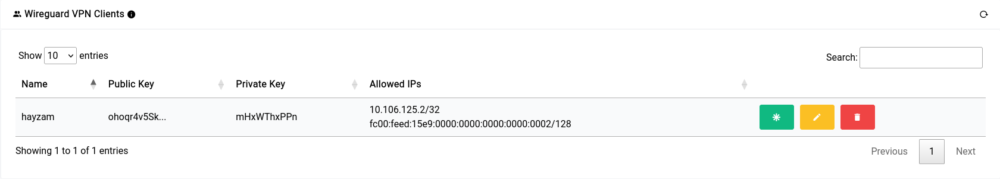
</a>
</center>

Now let’s generate a config for our client to import on their device. You can click the green asterisk button to do so.

Once that button is clicked a modal opens where you can twist a few knobs:

<a data-fancybox data-src="./img/40.gif" data-caption="WireGuard - Server - Peer - Config">
  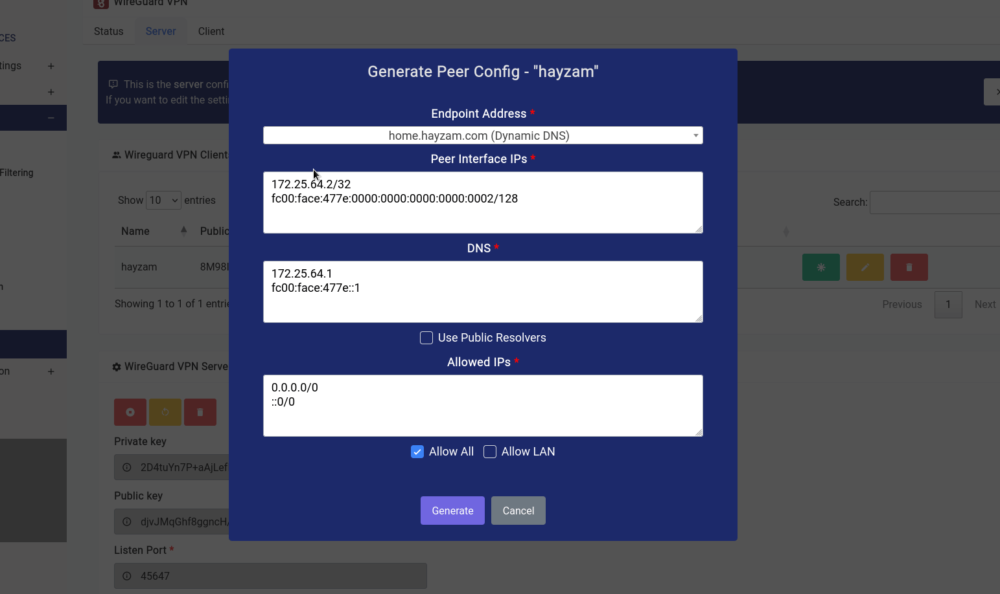
</a>

In our case, we want to let the client route all traffic through our endpoint, so we’ve checked the **Allow All** checkbox, if you want them to access the LAN range click on the Allow LAN check box and the LAN IP range should populate itself in the textarea.

You can have them use public resolvers (Cloudflare DNS is what we configured by default) but it’s recommended that you keep the default resolvers as they already have DoH enabled and will have the capability to block ads/other content filter stuff on the client as well.

As far as endpoint address goes you can see that we’ve selected a domain name that we’ve configured using the [Dynamic DNS Service](/services/dynamic-dns.html). But if you want to select the WAN IPv4 or WAN IPv6 (although not recommended) you can do so.

Once that’s all done and you click on the generate button a modal similar to this should open up:

<a data-fancybox data-src="./img/41.png" data-caption="WireGuard - Server - Peer - Config - Generated">
  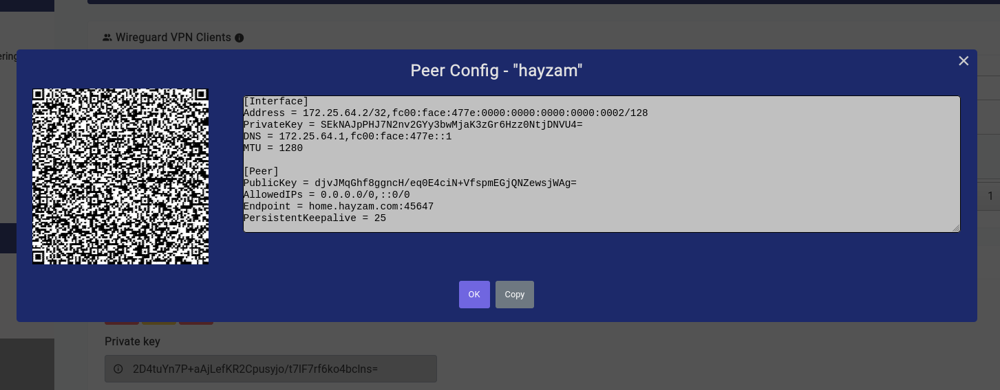
</a>

The QR code is very easy to import on phones as we’ve done in the video below:

<a data-fancybox data-src="./img/42.mov" data-caption="WireGuard - Server - Peer - Config - Generated - QR">
  <video src="./img/42.mov" controls="true" style="max-width: 100%;"></video>
</a>

You can always import that config into regular WireGuard clients as well, by simply copying and pasting the config into the WireGuard client of your choice.